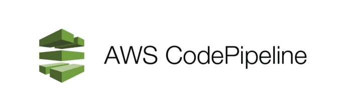

# *AWS CodePipeline Setup for Containerised  Applications*
<div style="text-align:center">
  
</div>


*AWS CodePipeline is a powerful tool for continuous integration and delivery. It allows developers to build, test, and deploy their applications automatically, without any manual intervention. And the best part is, it's not limited to any particular deployment platform.*

*Even though ECS and Fargate are popular choices for deploying Docker containers on AWS, they are not the only options. CodePipeline can be integrated with other deployment platforms such as Kubernetes, Docker Swarm, or even a custom deployment pipeline. The key to making this solution work is to ensure that the deployment platform is compatible with Docker containers. Once this compatibility is established, CodePipeline can be used to automate the entire deployment process. In summary, using AWS CodePipeline for a dockerized staging app without ECS or Fargate is indeed possible, and with the right setup, it can be a highly efficient solution.*

*This is a simple setup for using AWS CodePipeline and AWS CodeDeploy to deploy a Dockerized application to a staging environment. With this setup, you can run the Docker application on an EC2 instance without using ECS or Fargate services, with low operational overhead. This setup is intended only for a staging environment and is used with an Ubuntu 20.04 server.*

*This is a simple setup for using AWS CodePipeline and AWS CodeDeploy to deploy a Dockerized application to a staging environment. With this setup, you can run the Docker application on an EC2 instance without using ECS or Fargate services, with low operational overhead. This setup is intended only for a staging environment and is used with an Ubuntu 20.04 server.*

*Here, I used a simple Node.js application that I cloned from this [GitHub repo](https://github.com/jspruance/musician-app.git). In here, I'm putting all the code along with the sample application code. That may help you for a test run. Thanks to [JSpru](https://github.com/jspruance) for providing this sample application.*

*You can provide your code from GitHub, CodeCommit, S3, or any other source of your choice. I am focusing only on the deploy stage. Once you create the deployment in CodeDeploy, you can create a pipeline.*

*Copy the Dockerfile, apspec.yml, docker-compose.yml, and the scripts directory along with your code. Then follow the setup instructions below. Make sure to modify the Dockerfile and docker-compose.yml files according to your application requirements. In this setup, I have redirected container port 3001 to server port 3001.*

*You must update the scripts/validate_service.sh file based on your health check validation parameters.*
*Create your deployment with CodeDeploy and you will create a pipeline for the deployment.*

***Important files to deploy your application***</br>
*appspec.yml* </br>
*Dockerfile*</br>
*.dockerignore*</br>
*docker-compose.yml*</br>
*script/*</br>

***Tree***
```
.
├── appspec.yml
├── docker-compose.yml
├── Dockerfile
├── .dockerignore
├── README.md
└── scripts
    ├── build_start.sh
    ├── install_dependencies.sh
    ├── stop_container.sh
    └── validate_service.sh
