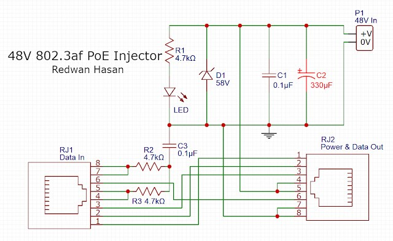
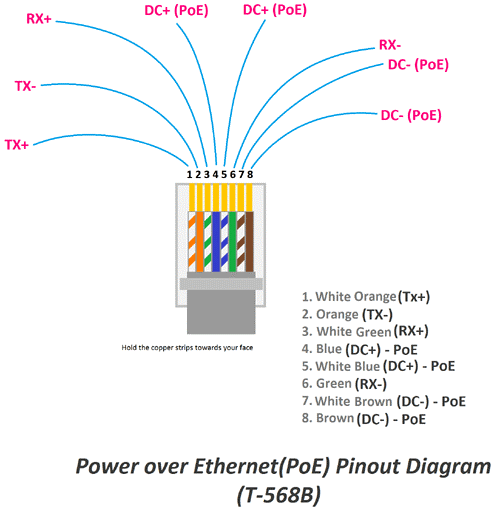
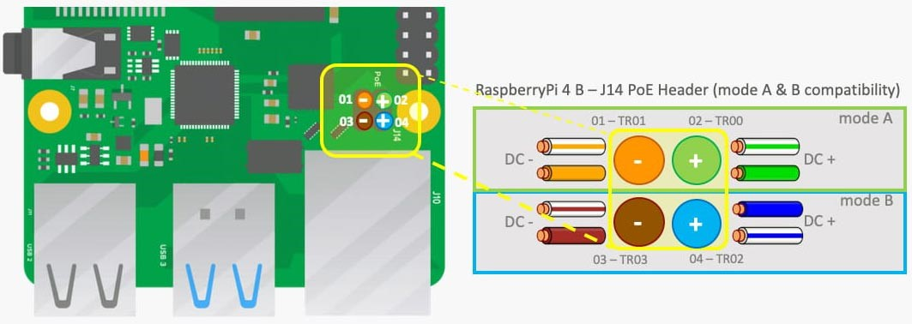

# LAN Cable Configuration & PoE Switch Connection

> **Purpose:**  
> This guide provides a clear overview of Ethernet cable types, pinouts, and Power over Ethernet (PoE) injection. Learn how to identify cable standards, understand PoE modes, and build a simple DIY PoE injector.

---

## Ethernet Cable Types & Pinouts

Ethernet cables (Cat5e, Cat6, Cat7) come in two main types:

- **Straight-Through:** Most common; used for connecting different devices (e.g., PC to switch).
- **Crossover:** Used for connecting similar devices (e.g., PC to PC, switch to switch).

Modern devices often auto-detect cable type (MDI-X), but knowing the pinouts is still important.

### RJ45 Pinout Standards

There are two global standards for wiring RJ45 connectors:

- **T568A:** Common in the USA & Asia (A for America)
- **T568B:** Common in the UK & Europe

Mixing standards usually works, but consistency is best.

| Pin | Wire Color      | Function         |
|-----|----------------|------------------|
| 1   | White/Green    | Transmit + (Tx+) |
| 2   | Green          | Transmit - (Tx-) |
| 3   | White/Orange   | Receive + (Rx+)  |
| 4   | Blue           | +VDC             |
| 5   | White/Blue     | +VDC             |
| 6   | Orange         | Receive - (Rx-)  |
| 7   | White/Brown    | -VDC/GND         |
| 8   | Brown          | -VDC/GND         |

> **Tip:**  
> Pin 1 is on the left with the clip at the rear.

#### T568A & T568B Pinouts

---

## Crossover Ethernet Cables

- Used for connecting two devices of the same type.
- Crossover cables swap transmit and receive pairs.
- Modern equipment often handles this automatically.

> **Note:**  
> Crossover cables may have a red sheath for easy identification.

---

## DIY PoE Injector Project

**PoE (Power over Ethernet):**  
Allows both data and power to be delivered over a single Ethernet cable—ideal for cameras, wireless APs, and other remote devices.

### Components

| # | Component                      | Qty |
|---|-------------------------------|-----|
| 1 | 4.7kΩ 1/4W Resistor           | 3   |
| 2 | 0.1µF Capacitor               | 2   |
| 3 | 330µF 100V Electrolytic Cap.  | 1   |
| 4 | Green LED (indicator)         | 1   |
| 5 | 58V Zener Diode               | 1   |
| 6 | RJ45 Female Jack              | 2   |
| 7 | 48V DC Power Source           | 1   |

**Use:**  
For DIY projects requiring 12/36/48V PoE on 10/100M connections.

### Circuit Diagram

**Description:**  
This circuit injects 48V onto the unused pins (Mode B) of a 10/100 Ethernet cable (802.3af). With a 48V/500mA source, you can deliver up to 15W—enough for most cameras or APs.

> **Caution:**  
> Double-check polarity before connecting!

---

## Ethernet Cable Pinout for PoE

Understanding which pairs carry data and which carry power is crucial for PoE projects.

- **PoE Mode A:** Power & data on pins 1, 2, 3, 6
- **PoE Mode B:** Power on pins 4, 5, 7, 8; data on 1, 2, 3, 6

> **Active PoE switches** support all modes;  
> **Passive PoE switches** support only Mode B.

---

## PoE for Raspberry Pi 3B+

We use **PoE Mode B** for the Raspberry Pi 3B+. See the pinout below:

---

## Building a PoE Injector for Raspberry Pi

A PoE injector lets you power devices (APs, IP cameras, phones) via Ethernet, even if your switch isn’t PoE-capable.

- **Inputs:** DC power + Ethernet port
- **Output:** Ethernet with injected DC voltage (e.g., 12V)

![PoE Injector Wiring][def]

**Key Points:**

- Pairs 4-5 and 7-8: Power transmission
- Pairs 1-2 and 3-6: Data transmission

---

> **Summary:**  
> With the right pinout knowledge and a simple injector circuit, you can easily add PoE capability to your network projects.

[def]: images/2.4.png